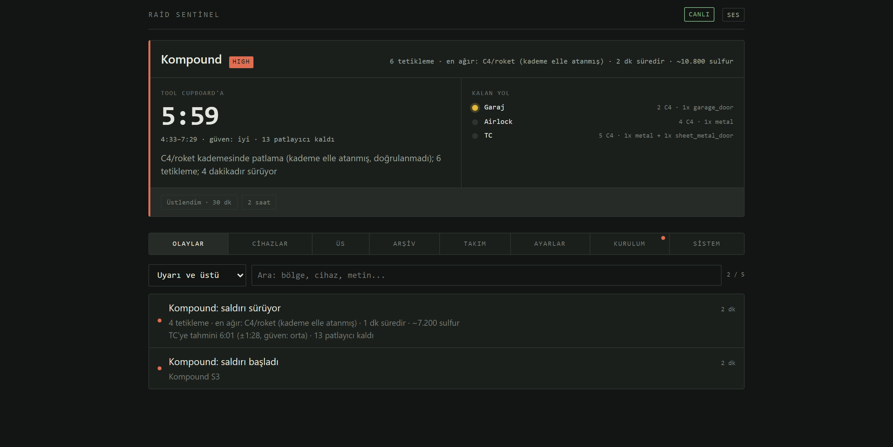
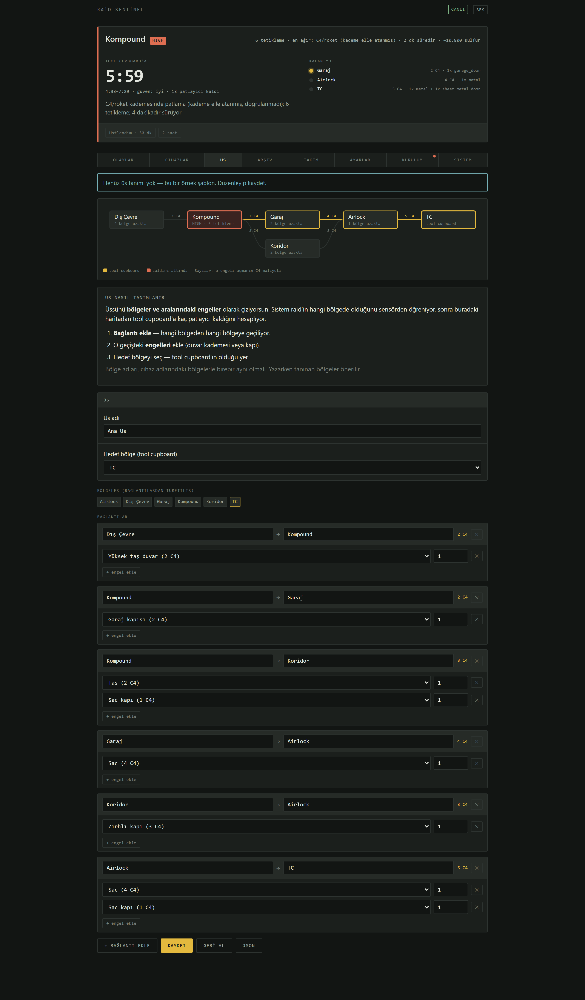
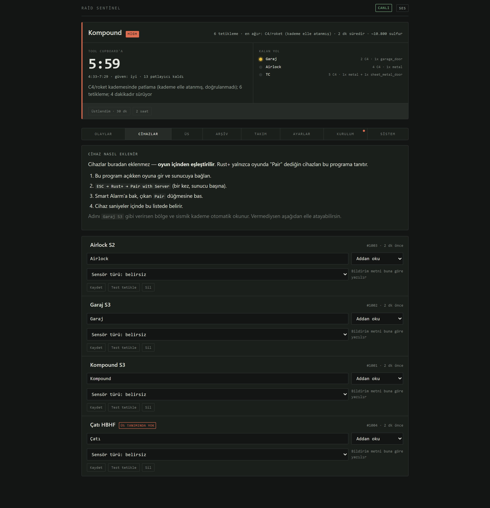
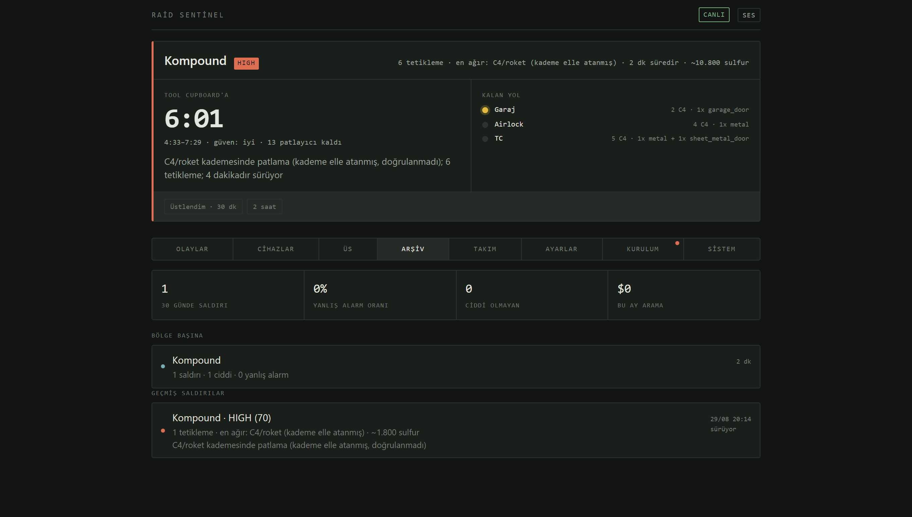
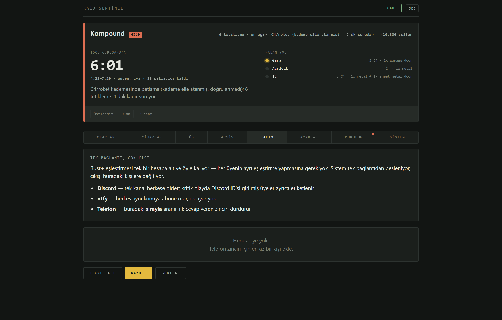
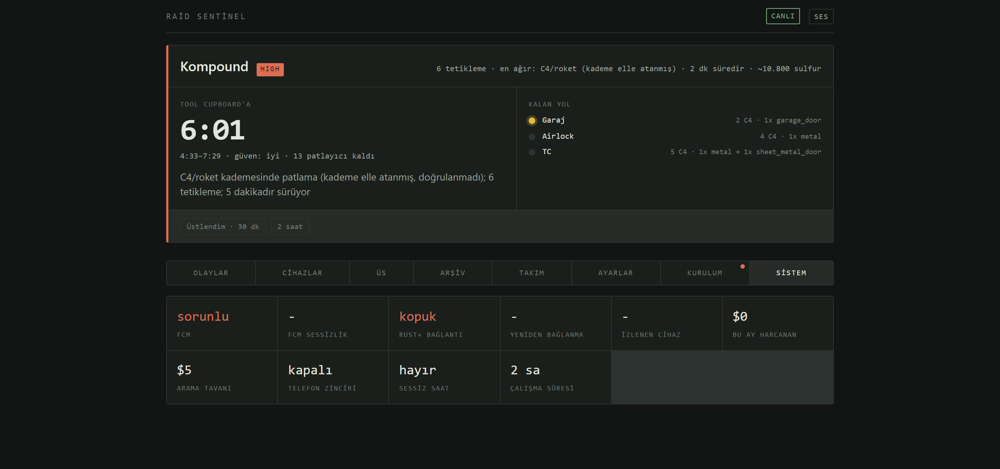
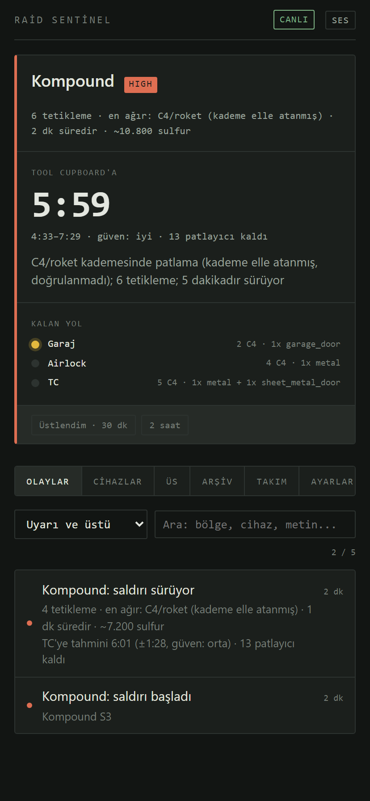

# Raid Sentinel

Self-hosted raid alarm for Rust. It watches your base through the Rust+
Companion API, decides whether an alarm is a real raid, and tells you how
long you have before the raiders reach your tool cupboard — on Discord, on
your phone via ntfy, and by actually calling you when it matters.

> 🇹🇷 Türkçe: [README.tr.md](README.tr.md) · [DEPLOY.tr.md](DEPLOY.tr.md)

---

## What it looks like

[](docs/screenshots/01-live.png)

**Live view.** The countdown is measured from the pace of *this* raid, not a
constant, and the range under it is the uncertainty rather than a hidden
average. When the base graph, the zone match or the measurements are missing
the panel says so instead of inventing a number. The summary marks a tier as
hand-assigned when it was never actually observed.

|  |  |
|:--|:--|
| [](docs/screenshots/02-base-map.png) | [](docs/screenshots/03-devices.png) |
| **Base** — your base as a graph. Red is the zone under attack, yellow is the cheapest path to the tool cupboard, and each number is the explosive cost of that obstacle. | **Devices** — devices are *not* added here; they are paired in game. This tab assigns zone, tier and sensor type, and can push a synthetic trigger through the real pipeline. |
| [](docs/screenshots/04-archive.png) | [](docs/screenshots/05-team.png) |
| **Archive** — past sessions, plus the number that decides whether you keep trusting the thing: false-alarm rate per zone. | **Team** — one Rust+ connection, many people notified. Nobody else has to install anything. |
| [](docs/screenshots/06-system.png) | [](docs/screenshots/07-mobile.png) |
| **System** — how long the push socket has been silent, reconnect count, spend. An alarm system that dies quietly is worse than none. | **Mobile** — the same panel, which is where you will actually read it. |

> The interface is **Turkish only** right now. Code, documentation, logs and
> the API are English; the interface strings are not yet extracted for
> translation. Everything is in one HTML file, so a translation is a
> find-and-replace away.

## Why this exists

Rust+ can already push "your Smart Alarm went off" to your phone. That is
not the hard part.

The hard part is that **during a raid you get dozens of triggers in
seconds**. Forwarding all of them makes the channel unreadable, and if each
one rings your phone the bill is real money. Most people end up turning the
alarm off.

So the value is not in relaying alarms. It is in:

1. **Filtering out false alarms** — a single motion trigger should not wake
   you at 4am; a single C4 charge should.
2. **Telling you how much time you have** — "someone is attacking" is not
   actionable. "9 minutes to the tool cupboard" is.

---

## What it does

- **Detects the explosive tier.** A Seismic Sensor outputs different power
  for grenades / satchels / C4, but Rust+ only exposes on-off. A small
  in-game circuit recovers the tier (see [In-game setup](#in-game-setup)).
- **Groups triggers into raid sessions** per zone. Fifty explosions become
  one alert, then periodic progress summaries.
- **Scores the threat** and routes by score: Discord for low, ntfy for
  medium, a phone call chain for high.
- **Estimates time to the tool cupboard** from a graph of your base, using
  the pace measured *during that raid* — not a hardcoded constant.
- **Calls your team in order**, first person to answer stops the chain.
  Voicemail does not count as an answer.
- **Never claims what it did not observe.** If a tier was assigned by hand
  rather than measured, the notification says so.

---

## Quick start

```bash
git clone <repo> raid-sentinel && cd raid-sentinel
python -m venv .venv
.venv/bin/pip install .          # Windows: .venv/Scripts/pip install .

sentinel pair                    # one time — opens a browser, sign in with Steam
sentinel run                     # leave running; panel at http://127.0.0.1:8787/
```

Then, in game:

1. `ESC → Rust+ → Pair with Server`
2. Look at each Smart Alarm and press **Pair**

Everything else — notification channels, base layout, team, thresholds — is
configured from the panel. No file editing required.

**Do not run this on your gaming PC.** When the PC is off — which is exactly
when you get offline-raided — the system is off too. A €4/month VPS is
enough. See [DEPLOY.tr.md](DEPLOY.tr.md) for Docker and systemd, including
how to pair on a headless server.

---

## How the connection works

There is no "connect" button in the panel, because you start the connection
from inside the game. The program cannot prove it owns your Rust account —
only the game can.

**1 · Registration** (`sentinel pair`, once). The program registers itself
with Google FCM as a fake Android device using the Rust+ app's Firebase
identity, converts the FCM token to an Expo push token, opens the Facepunch
login in your browser, and registers the resulting auth token with
`companion-rust.facepunch.com`. From then on Facepunch believes there is one
more Rust+ device on your account.

**2 · Server pairing.** When you press *Pair with Server*, the game server
asks Facepunch to push to your Steam ID. Facepunch → Google FCM → this
program. The payload carries the server address, port, player id and a
player token.

**3 · Live connection.** With those, the program opens a WebSocket **directly
to the game server** for entity subscriptions and health checks.

```
Game server ──► Facepunch ──► Google FCM ──► Sentinel      (pairing + alarms)
Sentinel ──────────── WebSocket ───────────► Game server   (live data)
```

Both connections are **outbound**. No static IP, no port forwarding, no open
ports. Works behind NAT.

> Some hosts block the Rust+ app port. If the WebSocket cannot connect, turn
> on *Settings → Connection → route through the Facepunch proxy*.

---

## In-game setup

A Seismic Sensor emits **different power depending on what exploded**
(1 = grenade/beancan, 2 = explosive ammo/satchel, 3 = C4/rocket). Rust+
flattens this to on-off, losing the tier.

You recover it with electricity: feed the sensor output through
**Electrical Branches set to 1** into three separate Smart Alarms. Which
alarms fire encodes the power level like a thermometer.

```
Seismic Sensor ──► Branch(1) ──┬──► Alarm "Garage S1"     every explosion
                     │
                     └ P−1 ──► Branch(1) ──┬──► Alarm "Garage S2"   P ≥ 2
                                 │
                                 └ P−2 ────────► Alarm "Garage S3"  P = 3
```

Per zone you need:

| Item | Qty | Cost | Workbench |
|---|---|---|---|
| Seismic Sensor | 1 | 3 HQM + 1 Tech Trash | 2 |
| Smart Alarm | 3 | 9 HQM + 3 Tech Trash | 2 |
| Electrical Branch | 2 | 150 metal frags | 1 |
| Solar Panel + Small Battery | 1 + 1 | 10 HQM + 1 Tech Trash | 1 |

Total draw is 4 rW; one solar panel covers it. Feed the sensor **at least
4 rW** — it cannot output a level it did not receive, so a starved sensor
clamps tier 3 down to 1.

**Keep the sensor range at 10–15 m.** At 30 m your neighbour's raid wakes
you up.

### Naming

The name you give a device in game is the configuration:

| In-game name | Zone | Tier |
|---|---|---|
| `Garage S3` | Garage | 3 — C4 / rocket |
| `Airlock S2` | Airlock | 2 — satchel |
| `Roof` | Roof | none |

Separator can be a space, `_` or `-`. Devices that do not follow the
convention can be assigned a zone and tier from the panel instead.

**Zone names must match your base definition exactly.** `garage` and
`Garage` are different zones; a mismatch silently disables the ETA. The
panel's *Setup* tab flags this.

### Sensor type matters

Mark each device as **Seismic** (sees explosions) or **HBHF** (sees people)
in the panel. The notification wording follows: an HBHF trigger reports
"movement detected", never "C4 detonation" — even if you assigned tier 3 to
it by hand. A system that claims what it did not observe is worse than one
that says less.

---

## Threat scoring

Every trigger is scored, and the score decides both the notification
severity and whether the phone rings.

| Evidence | Points |
|---|---|
| C4 / rocket tier explosion | +60 |
| Satchel / explosive ammo tier | +40 |
| Light explosive (grenade, beancan) | +15 |
| Two or more distinct sensors | +25 |
| Three or more triggers | +15 |
| Sustained for 90+ seconds | +15 |
| Teammate near the zone | −30 |

Thresholds: **HIGH** 60+, **MEDIUM** 35+, **LOW** 15+.

In practice a single C4 detonation is immediately HIGH — nobody C4s their
own base, so no second signal is needed. A single motion trigger scores 10
and notifies nobody.

The teammate penalty applies **only when there is no explosive evidence**.
It exists to suppress HBHF false positives; if a seismic sensor saw an
explosion, that evidence is not negotiable.

---

## ETA

Define your base as zones and the obstacles between them (panel → *Base*
tab, visual editor with a live topology map). The system finds the
**cheapest path** to the tool cupboard and converts it to time:

```
ETA = remaining explosives × measured trigger interval + zone transit time
```

The pace is **measured during the raid**, not assumed — there is no reliable
published figure for "seconds per wall". Early on confidence is *low*; it
narrows as measurements accumulate.

Uncertainty is shown as a band rather than hidden: tier 3 could be C4 or a
rocket, and those need different counts per wall.

**The ETA stays silent when it does not know**: no base definition, unknown
zone, unknown explosive tier, or not enough measurements. A made-up "3
minutes" gets someone raided.

---

## The panel

Served at `http://127.0.0.1:8787/` while `sentinel run` is active. Single
HTML file, no build step, no external assets — it works on a VPS with no
internet access to anything but the APIs it needs.

| Tab | What it does |
|---|---|
| *(top)* | Active raids: threat, live countdown, remaining path, why the alarm fired, and **"I've got this"** to silence the call chain |
| **Events** | Live feed with severity filter and text search |
| **Devices** | Paired devices; assign zone, tier and sensor type; **test trigger** pushes a synthetic event through the real pipeline |
| **Base** | Visual topology map + connection editor with live cost preview |
| **Archive** | Past raid sessions and analytics — false-alarm rate per zone, triggers per device, monthly call spend |
| **Team** | One connection, many people (see below) |
| **Settings** | Channels, Twilio, thresholds, limits — applied without restarting |
| **Setup** | Live checklist + in-game guide |
| **System** | FCM silence, connection state, reconnects, spend |

`/health` returns **503** when the system is unhealthy — point an uptime
monitor at it, because the way alarm systems fail is silently.

### One connection, many people

Rust+ pairing stays on a single account. Every teammate pairing separately
would be pointless work repeated every wipe. The system feeds from one
connection and fans out:

- **Discord** — one channel for everyone; members with a Discord ID get
  mentioned on critical events
- **ntfy** — everyone subscribes to the same topic
- **Phone** — called in the order listed, first answer stops the chain

Members can be deactivated without deleting them.

---

## Phone calls

Configure Twilio in *Settings*, add people in *Team*, then use
**"Test the phone"** before trusting it.

The call says, twice (whoever just picked up missed the first pass):

> *"Attention. Garage zone is under attack. Three triggers, C4 tier
> detonation, ongoing for two minutes. Estimated six minutes to the tool
> cupboard."*

TwiML is sent inline with the request, so **the machine does not need to be
reachable from the internet** — no inbound webhook. The result is learned by
polling the call record.

### Cost (Turkey mobile, verified against Twilio's own pricing)

**Unanswered calls are free.** Only calls that reach `completed` are billed;
ringing time on a call nobody picks up costs nothing.

| Item | Cost |
|---|---|
| Per minute | $0.2875 — **rounded up**, a 20-second call bills a full minute |
| Answering machine detection | $0.0075 per call (this system uses it) |
| Text to speech (Polly) | $0.0008 per 100 characters |
| Number rental | $1.15/month, charged up front, not prorated |

**Real cost per call ≈ $0.30.** The system reads the actual price Twilio
reports rather than estimating, and enforces a monthly cap.

> **Voicemail costs money and does not stop the chain.** Twilio counts it as
> answered and bills it; this system correctly does not, and moves to the
> next person. Turn voicemail off on the numbers in the chain.

> Turkish text-to-speech is **not confirmed** — `tr-TR` does not appear in
> Twilio's supported voice table. Test it; if there is no audio, switch to
> `en-US` + `Polly.Joanna` in Settings.

Trial accounts: verified numbers only, 10-minute cap, 5 concurrent calls,
and Twilio prepends its own spoken notice before your message.

---

## Reliability

Alarm systems fail silently — everything looks fine and nothing arrives.
Three defences, all found necessary in live testing:

- **Active liveness probe.** Every 4 minutes the system pushes a
  notification *to itself* and confirms it arrives. This connection has no
  heartbeat, so silence proves nothing; the probe produces evidence instead
  of waiting for it. If it fails, the listener is rebuilt.
- **Reconnect and resubscribe.** The underlying library does neither. It
  also leaks server-side subscriber slots on restart, which eventually
  returns `too_many_subscribers` and kills the event flow entirely — so
  subscriptions are checked before creating and released on shutdown.
- **Health endpoint.** `/health` reports 503 when FCM is silent or the
  WebSocket is down.

---

## Honest limitations

- **It does not stop a raid.** It buys you information and maybe a few
  minutes. If you cannot get back to defend, its value is low.
- **It cannot see melee raids.** A seismic sensor only detects explosions;
  someone picking through the soft side of a stone wall is invisible.
- **If the sensors lose power, the system goes blind.** You see the first
  breach and possibly nothing after.
- **Tier and zone must come from the same alarm.** You cannot run one global
  thermometer and cheap per-zone alarms; each zone needs its own trio.
- **The Companion API is unofficial.** No known bans, no guarantees.
- **The ETA is only as good as your base definition.** Upgrade your walls
  and forget to update it, and it will lie to you.
- **Rebuild cost repeats every wipe.** This is the real recurring price, and
  no amount of code removes it.
- **The panel is Turkish only.** Notifications and the panel speak Turkish;
  the code, logs and API do not.

---

## Commands

```bash
sentinel pair           # Rust+ pairing (once)
sentinel run            # run the system
sentinel doctor         # check configuration
sentinel base           # validate the base definition and show paths
sentinel test-notify    # send a sample alert to configured channels
sentinel test-call      # place a real phone call
```

## Development

The README screenshots are generated, not taken by hand — start the demo
panel and run the capture script:

```bash
python scripts/demo_panel.py
```

```bash
python scripts/screenshots.py
```

```bash
.venv/bin/pip install -e ".[dev]"
python -m pytest -q
python -m ruff check src/ tests/
python scripts/demo_panel.py    # panel with fake data, no Rust+ needed
```

167 tests. See [TESTING.md](TESTING.md) for the four-level test plan,
including live in-game scenarios.

## Data

Everything lives in `data/`, and it is the only directory worth backing up:

| File | Contents | If lost |
|---|---|---|
| `rustplus.config.json` | FCM credentials, paired server | Re-pair |
| `sentinel.db` | Event history, devices | History and zone assignments gone |
| `settings.json` | Panel settings | Re-enter |
| `base.json` | Base definition | ETA stops until redrawn |
| `team.json` | Team members | Re-enter |

`rustplus.config.json` contains a token derived from your Steam session —
do not share backups.

## Security

The panel has **no authentication by default** and binds to `127.0.0.1`.
Reach it over an SSH tunnel:

```bash
ssh -L 8787:localhost:8787 user@server
```

If you must expose it, set `PANEL_TOKEN` in Settings and put a reverse proxy
with TLS in front. Twilio credentials can be changed from the panel, so an
open panel is a money-spending surface.

## Credits

Built on [rustplus](https://github.com/olijeffers0n/rustplus) and
[push_receiver](https://github.com/olijeffers0n/push_receiver). The Rust+
protocol documentation in
[rustplus.js](https://github.com/liamcottle/rustplus.js) was invaluable.

Game data (wall HP, explosive counts, sulfur costs) verified against
wiki.facepunch.com and wikirust.com in August 2026. These values are
version-dependent and Facepunch rebalances them; they live in
`src/sentinel/raiddata.py` with a verification date, not scattered through
the code.
